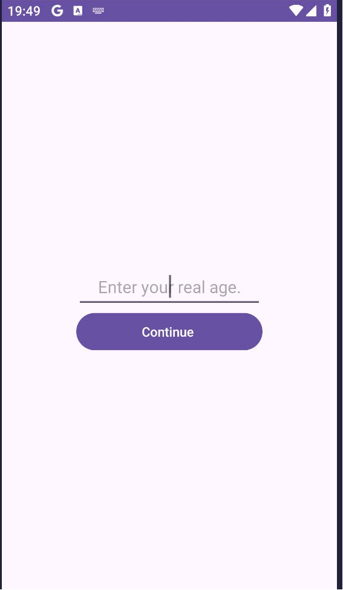
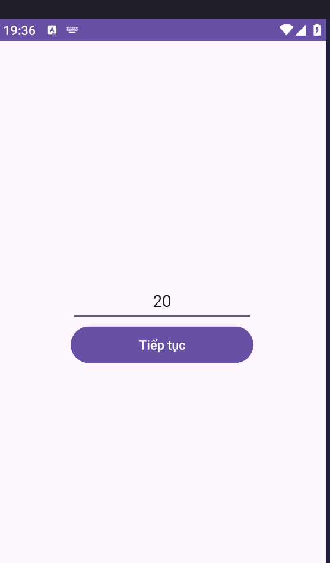
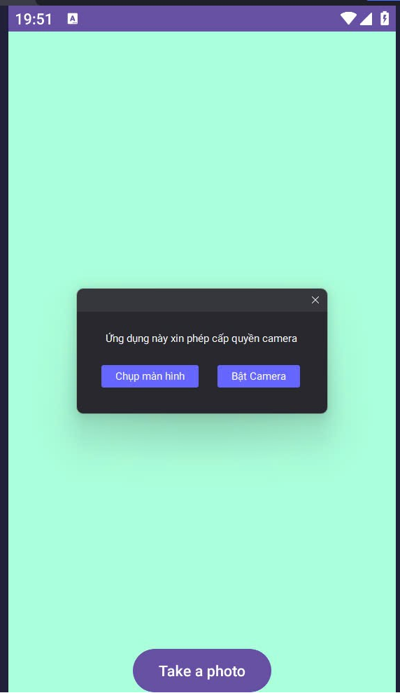
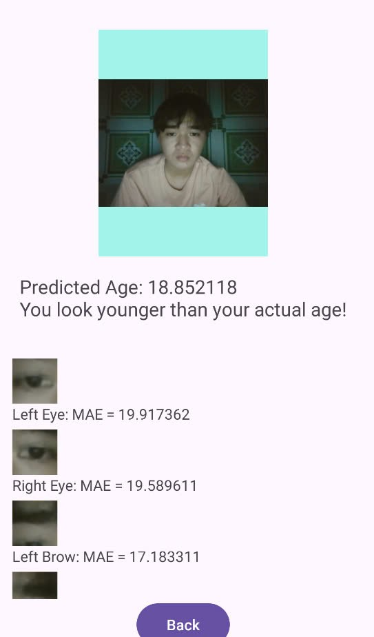
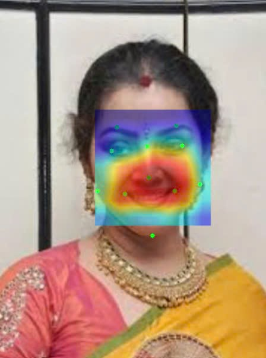
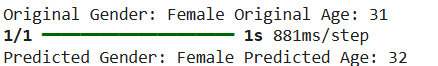
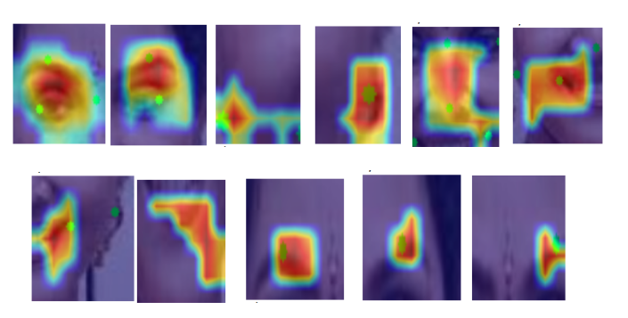
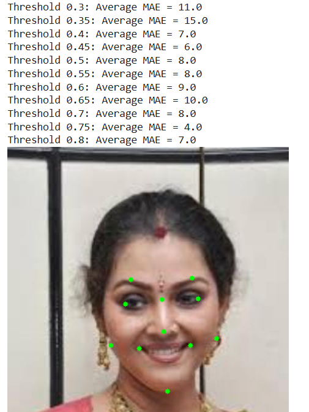

# 🛡️ 🎂 Age & Gender Prediction with Grad-CAM (Early Aging Assessment)

Dự án nghiên cứu và phát triển hệ thống thông minh có khả năng nhận diện tuổi, giới tính từ hình ảnh khuôn mặt, đồng thời sử dụng công nghệ Grad-CAM để trích xuất các đặc trưng phục vụ đánh giá mức độ lão hóa sớm.

## 📑 Tổng quan đề tài
Mục tiêu: Xây dựng mô hình học sâu dự đoán tuổi/giới tính và trực quan hóa các vùng quan trọng trên khuôn mặt (nếp nhăn, kết cấu da) ảnh hưởng đến kết quả dự đoán.

Nền tảng triển khai: Ứng dụng di động Android (TensorFlow Lite)

## 🚀 Luồng xử lý chính

## 🛠️ Công nghệ sử dụng (Tech Stack)
Mô hình AI: Mạng nơ-ron tích chập (CNN) và kiến trúc ResNet-18.

Kỹ thuật trực quan: Grad-CAM (Gradient-weighted Class Activation Mapping) giúp giải thích quyết định của mô hình.

Công cụ: Python (OpenCV, PyTorch, Pandas) cho huấn luyện.

TensorFlow Lite (TFLite) để tối ưu hóa trên di động.

shape_predictor_68_face_landmarks.dat để xác định các điểm mốc khuôn mặt.

## 🖼️ Demo & Kết quả thực nghiệm

### Giao diện hệ thống

Ứng dụng Android dự đoán tuổi và trích xuất đặc trưng với Grad-CAM sử dụng mô hình học sâu CNN được tích hợp qua TensorFlow Lite (TFLite) để dự đoán tuổi và giới tính từ hình ảnh khuôn mặt thu thập qua camera.

### Kết quả dự đoán

Ứng dụng cho biết tuổi dự đoán và sẽ tính 11 đặc trưng trên khuôn mặt để xem vùng nào ảnh hưởng đến sự lão hóa

## 📊 Kết quả thực nghiệm
Dự đoán giới tính: Độ chính xác đạt 95%.

Dự đoán độ tuổi: Sai số trung bình tuyệt đối (MAE) chỉ 4.2.

Khả năng giải thích: Trích xuất thành công 11 điểm đặc trưng giúp xác định các dấu hiệu lão hóa rõ rệt

## Kết quả Grad-CAM

## Kết quả của dự đoán tuổi và giới tính

## Kết quả Grad-Cam của 11 điểm trên khuôn mặt

## Kết quả dự đoán ngưỡng và trung bình lỗi tuyệt đối (MAE)

## 📂 Cấu trúc thư mục dự án

/app: Mã nguồn ứng dụng Android.

/sdk: Thư viện OpenCV và các công cụ hỗ trợ.

/models: Chứa file resnet50.tflite và các tệp cấu hình mô hình.

